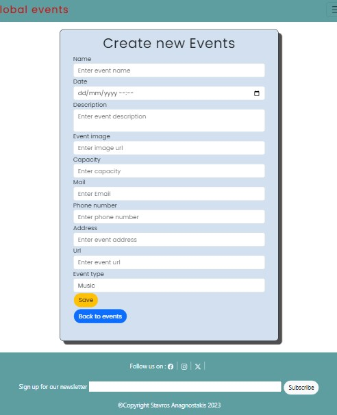
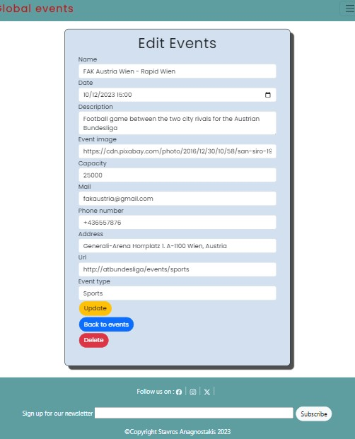

# Global events webapp
## CRUD symfony 6
* Create new event

* Update existing event

* Delete event
* Display all the events in the main page

* Filter events according to type
* Responsive design

